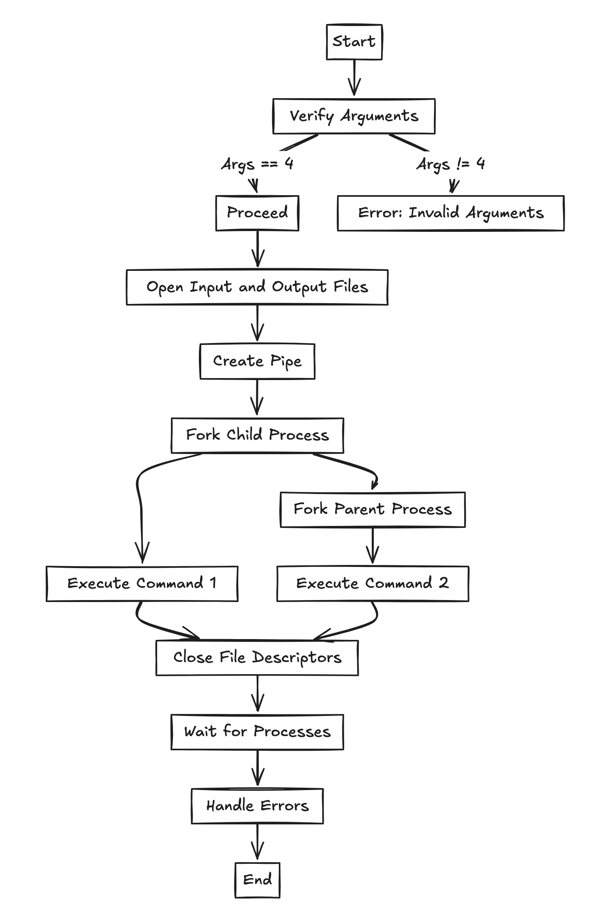

# Pipex


Pipex is a simple implementation of a Unix pipeline. It takes an input file, processes it through two commands, and outputs the result to an output file. This project is a great way to understand how pipes and process management work in Unix-like operating systems.

## Table of Contents

- [Installation](#installation)
- [Usage](#usage)
- [Functions](#functions)
- [Contributing](#contributing)
- [License](#license)

## Installation

To compile the project, run the following command:

```
make
```

This will generate the `pipex` executable.

## Usage

To run the program, use the following command:

```
./pipex infile cmd1 cmd2 outfile
```

- `infile`: The input file.
- `cmd1`: The first command to execute.
- `cmd2`: The second command to execute.
- `outfile`: The output file.

Example:

```
./pipex input.txt "grep hello" "wc -l" output.txt
```

This command will take `input.txt`, run `grep hello` on it, then pipe the result to `wc -l`, and finally write the output to `output.txt`.

## Functions

### Main Functions

- `int main(int argc, char **argv, char **env)`: Entry point of the program.
- `int pipex(t_pipex_args *args)`: Manages the creation of pipes and processes.

### Helper Functions

- `void ft_putstr_fd(char *s, int fd)`: Writes a string to a file descriptor.
- `char *ft_strjoin(char const *s1, char const *s2)`: Concatenates two strings.
- `size_t ft_strlen(const char *s)`: Calculates the length of a string.
- `int ft_strncmp(const char *s1, const char *s2, size_t n)`: Compares two strings up to n characters.
- `char **ft_split(char const *s, char c)`: Splits a string by a delimiter.
- `char *get_path_variable(char **env)`: Retrieves the PATH environment variable.
- `char *search_command_in_paths(char *cmd, char **paths)`: Searches for a command in the given paths.

### Process Management

- `static void child_process(int pipefd[2], char *infile, char *cmd, char **env)`: Handles the child process.
- `static void parent_process(int pipefd[2], char *outfile, char *cmd, char **env)`: Handles the parent process.

## Contributing

Contributions are welcome! Please open an issue or submit a pull request for any improvements or bug fixes.
